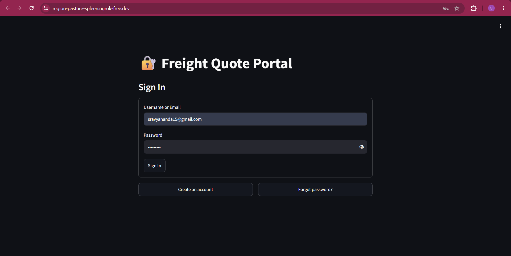
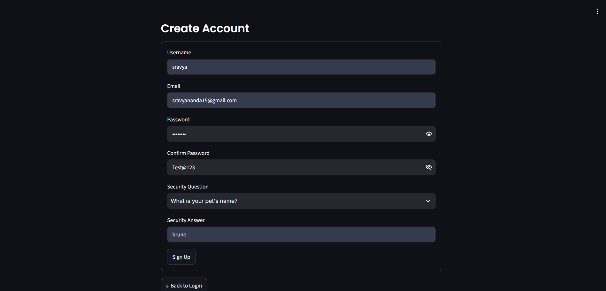
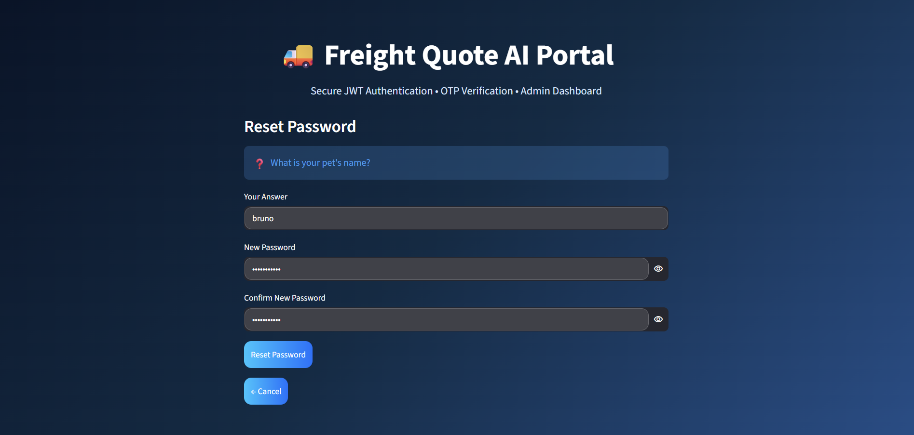
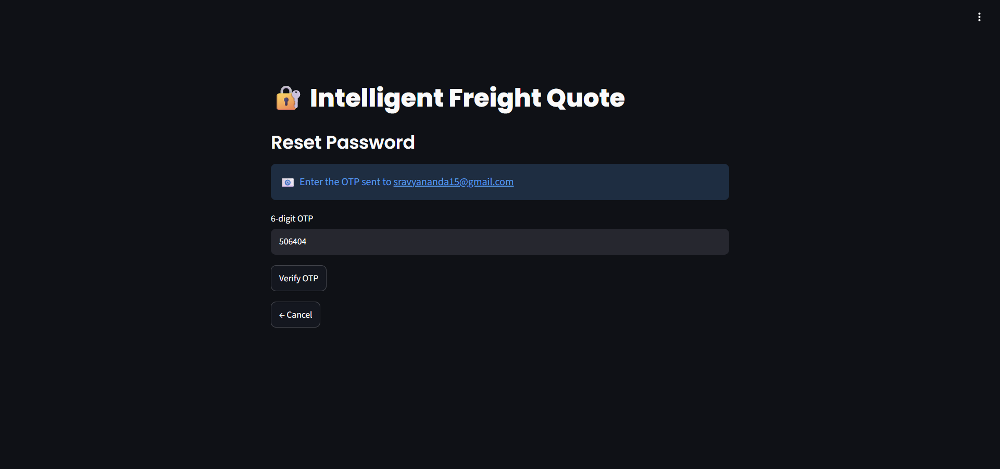
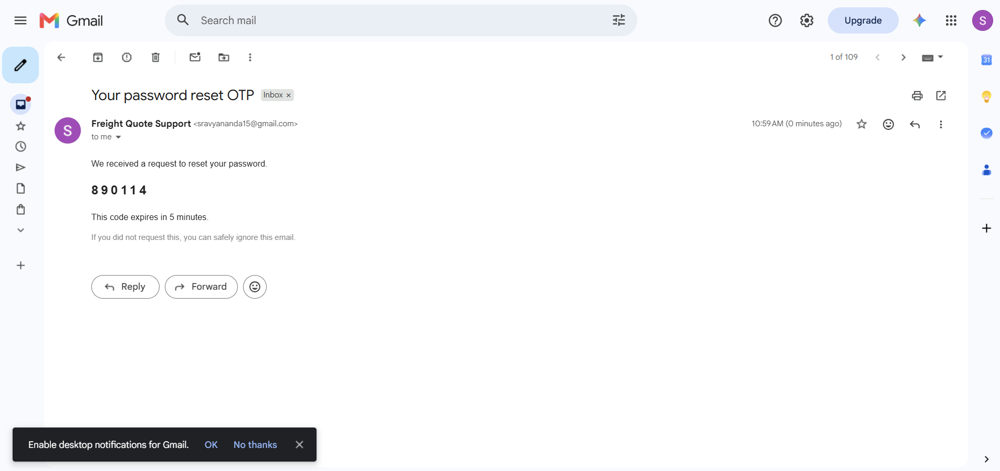
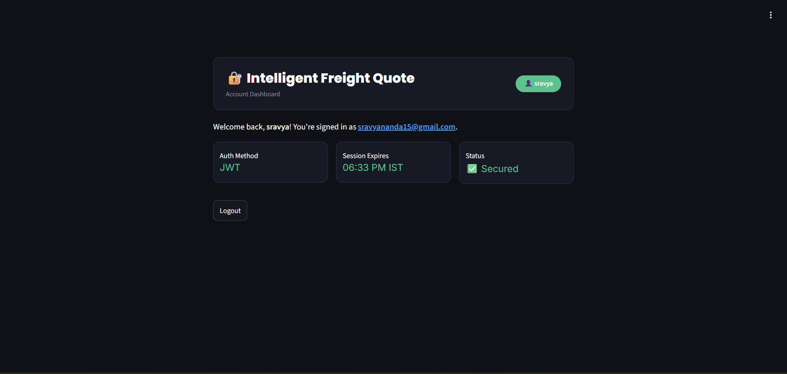
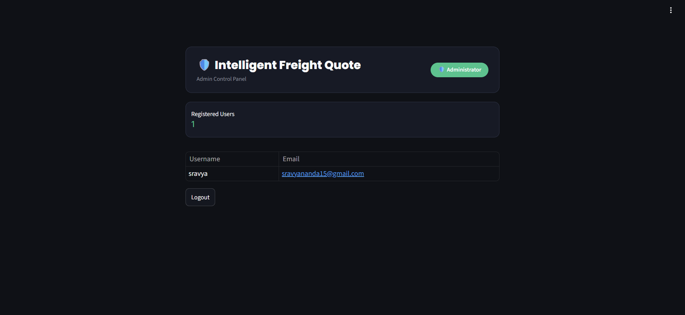

# Milestone 1 — User Authentication Module

**Infosys Springboard 7.0 · Intelligent Freight Quote Generation**

Mentor: Mohamedsipli M

Author: Sravya Nanda

## What this is

Before the freight quote system can do anything useful, users need a way to sign up, log in, and get back into their account if they forget their password. That's what this milestone builds — a full authentication system running as a Streamlit app inside Google Colab, made public through ngrok.

## What's built

- **Login** with username or email + password. A generic error shows on failure so it never gives away whether the username or password was wrong.
- **Signup** with username, email, password, confirm password, and a security question picked from a fixed list. Duplicate usernames or emails get rejected.
- **Forgot Password**, with two ways to recover: answering your security question, or getting a 6-digit OTP sent to your email (expires in 5 minutes).
- **JWT session handling** — a token is issued only when you log in, so signup and password resets always send you back to the login page for a fresh session.
- **User dashboard** showing a welcome message and a logout button.
- **Admin dashboard** with its own separate hardcoded login, showing the list of all registered users (no passwords ever shown).
- Basic validation everywhere: no empty fields, a real-looking email format, and passwords need 8+ characters with a mix of upper/lowercase, a number, and a special character.

## Tech stack

- Streamlit
- PyJWT
- bcrypt
- SQLite
- Gmail SMTP (for OTP emails)
- pyngrok
- Google Colab

## How to run it

1. Open `Milestone1_Auth_Module.ipynb` in Colab.
2. Add 4 secrets under the key icon (Colab Secrets), with notebook access turned on for each: `JWT_SECRET` (any random string), `NGROK_AUTHTOKEN` (from ngrok.com), `EMAIL_ADDRESS`, and `EMAIL_PASSWORD` (a Gmail App Password, not your regular password).
3. Run all three cells top to bottom.
4. Open the ngrok URL it prints out.

Note: every fresh Colab session starts with an empty database, so you'll need to sign up a test account again after any restart.

## Screenshots

### Login

### Signup

### Forgot Password — Security Question

### Forgot Password — OTP

### OTP Email

### User Dashboard

### Admin Dashboard

